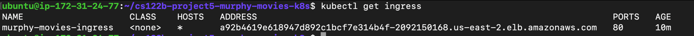
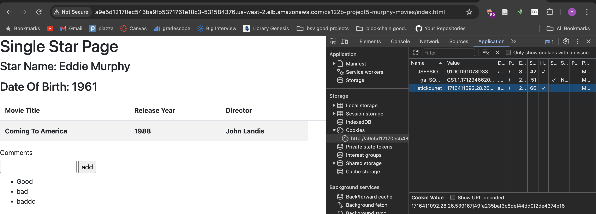

# Kubernetes Scripts for deploying Murphy-Movies Project

This repo contains kubernetes scripts to be executed in your Ubuntu instance after logging in as the kOps user.
## Pre-requisites
1. Make sure you have a AWS Kubernetes cluster set up (follow Task 3.1 and 3.2 from Project 5 in your AWS Ubuntu instance).
2. Set up MySQL pods through the helm chart.
```
helm install mysql --set auth.rootPassword=root,auth.database=murphymovies,auth.username=mytestuser,auth.password='My6$Password',secondary.persistence.enabled=true,secondary.persistence.size=2Gi,primary.persistence.enabled=true,primary.persistence.size=2Gi,architecture=replication,auth.replicationPassword=texera,secondary.replicaCount=1 oci://registry-1.docker.io/bitnamicharts/mysql
```
3. Populate MySQL database => 
   1. Run `kubectl exec -it pod/mysql-primary-0 -- /bin/bash`.
   2. Run `mysql -u root -p` & enter password as `root`.
   3. Run the SQL scripts from [Murphy Movies repo](https://github.com/UCI-Chenli-teaching/cs122b-project5-murphy-movies?tab=readme-ov-file#prepare-the-database-murphymovies).
   4. Grant `mytestuser` privileges: `GRANT ALL PRIVILEGES ON * . * TO 'mytestuser'@'%';`
4. Enable ingress in your AWS cluster.
   1. Run the following to install ingress-nginx.
   ```
   helm upgrade --install ingress-nginx ingress-nginx \
      --repo https://kubernetes.github.io/ingress-nginx \
      --namespace ingress-nginx --create-namespace 
   ```
## Steps to deploy scripts
1. Clone the repo into your Ubuntu instance
2. Run `kubectl apply -f murphy-movies.yaml`.
3. Run `kubectl apply -f ingress.yaml`.
4. Run `kubectl get ingress` to see your list of ingresses.
5. You should see an `ADDRESS` after a couple of minutes. You can then access the application on http://<AWS_ELB_URL>/cs122b-project5-murphy-movies.

6. You can also test sticky sessions by inspecting cookies to find `stickounet` cookie.

